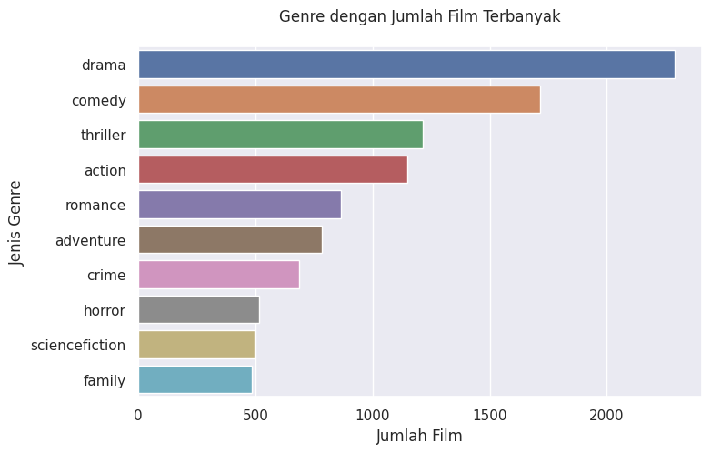
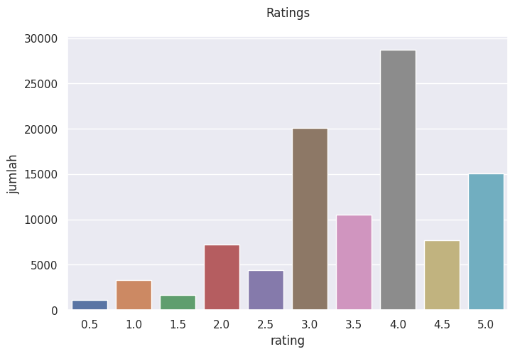
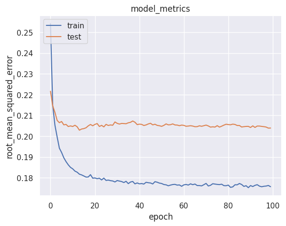

# Sistem Rekomendasi Film dengan Machine Learning - Bayu Firmansyah
###### 

## Project Overview
### Latar Belakang

Industri perfilman di luar negeri dan di Indonesia mengalami pertumbuhan yang signifikan dalam beberapa tahun terakhir, dengan semakin banyaknya produksi film dan penonton yang semakin banyak. Di Indonesia total penonton film Indonesia di bioskop mencapai 54 juta, angka ini mengalami kenaikan dibandingkan tahun 2019 sebelum masa pandemi sebanyak 51,9 juta penonton. Pada masa pandemi jumlah penonton turun drastis yakni menjadi 12,8 juta pada 2020 dan menjadi 4,5 juta pada 2021[[2]](https://mediaindonesia.com/humaniora/548410/penonton-film-indonesia-di-bioskop-pada-2022-mencapai-54-juta-orang).
Dengan jumlah produksi film yang semakin banyak saat ini mengakibatkan peningkatan pilihan film yang tersedia bagi penonton, namun pada saat yang sama membuat mereka kesulitan untuk menemukan film yang sesuai dengan selera dan preferensi mereka. Mencari film memerlukan waktu, dan terkadang film yang dipilih tidak sesuai harapan, sehingga menyebabkan pemborosan waktu.

Perkembangan teknologi kecerdasan buatan dan algoritma pembelajaran mesin memungkinkan analisis data yang kompleks dan pengolahan besar-besaran informasi untuk menghasilkan rekomendasi yang akurat dan relevan.
Sistem rekomendasi merupakan program atau sistem penyaringan informasi yang menjadi solusi dalam masalah kelebihan informasi dengan cara menyaring sebagian informasi penting dari banyaknya informasi yang ada dan bersifat dinamis sesuai dengan preferensi, minat, atau perilaku pengguna terhadap suatu barang. Sistem rekomendasi dirancang untuk memahami dan memprediksi preferensi pengguna berdasarkan perilaku pengguna[[4]](https://ieeexplore.ieee.org/document/8821893).

Penerapan sistem rekomendasi untuk memberikan rekomendasi film akan mempermudah pencarian film tertentu dari banyak kumpulan film sesuai dengan preferensi pengguna. Ini memudahkan penonton untuk menemukan film yang mereka sukai tanpa harus menghabiskan waktu untuk mencari secara manual. Selain itu, sistem rekomendasi film juga dapat membantu meningkatkan kepuasan pengguna dan penjualan film yang akan menguntungkan pemilik *platform*.

Sistem rekomendasi telah implementasi untuk merekomendasikan film pada *platform* seperti *Netflix, Amazon Prime Video*, dan *Apple TV*. Penelitian terkait telah dilakukan sebelumnya beberapa diantaranya yaitu pada penelitian Sharma, P. dan Yadav, L. Y. (2020). dengan judul *Movie Recommendation System Using Item Based Collaborative Filtering*[[3]](https://ssrn.com/abstract=3672412). Pada penelitian lain Bei-Bei Cui. (2017). melakukan penelitian dengan topik serupa dengan judul *Design and Implementation of Movie Recommendation System Based on Knn Collaborative Filtering Algorithm*, artikel ini merancang dan mengimplementasikan prototipe sistem rekomendasi film berdasarkan algoritma KNN, algoritma penyaringan kolaboratif, dan teknologi sistem rekomendasi algoritma[[1]](https://doi.org/10.1051/itmconf/20171204008).

Pada proyek ini akan mengembangkan sistem rekomendasi film untuk membantu mempersempit pilihan film bagi calon penonton, meningkatkan pengalaman menonton, dan memperkenalkan penonton pada film-film yang mungkin tidak akan mereka temukan secara mandiri. Dengan analisis data dan algoritma cerdas, sistem ini dapat memberikan rekomendasi yang semakin tepat sesuai dengan preferensi setiap individu, menciptakan pengalaman menonton yang lebih menyenangkan dan memuaskan.

## Business Understanding

Perusahaan *platform streaming* dan layanan film  mengumpulkan data tentang perilaku penonton, seperti film yang mereka tonton, frekuensi menonton, dan penilaian yang diberikan. Data ini sangat berharga bagi penyedia layanan untuk menganalisis tren preferensi dan kecenderungan penonton, sehingga mereka dapat memahami pasar dan meningkatkan penawaran layanan mereka. Dengan data *platform streaming* dapat menawarkan rekomendasi film berdasarkan kemiripan karakteristik film seperti genre atau rekomendasi film berdasarkan kemiripan penilaian penggunanya. Bagi *platform streaming* dan layanan film lainnya, sistem rekomendasi merupakan alat strategis untuk meningkatkan retensi pelanggan. Dengan memberikan rekomendasi film yang akurat, *platform* dapat membuat penonton tetap tertarik dan terlibat, sehingga mereka lebih cenderung untuk tetap berlangganan dan menggunakan *platform* tersebut secara berkelanjutan.

### Problem Statement
- Bagaimana cara membangun sistem rekomendasi berdasarkan genre film ?
- Bagaimana cara membangun sistem rekomendasi berdasarkan *rating* pengguna terhadap film ?
 
### Goals
- Membuat  sistem rekomendasi berdasarkan genre film.
- Membuat sistem rekomendasi berdasarkan *rating* pengguna terhadap film.

### Solution Statement
Untuk mencapai tujuan tersebut, sistem akan menerapkan pendekatan solusi menggunakan metode *content-based filtering* dan *collaborative filtering*.

- *Content-based Filtering*:

  Teknik *Content-Based Filtering* adalah metode dalam sistem rekomendasi yang berfokus pada analisis dan perbandingan fitur dari item yang ingin direkomendasikan dengan profil pengguna. 
Dalam *content-based filtering* setiap item memiliki representasi fitur yang menggambarkan kontennya. Pada proyek ini akan dibuat sistem rekomendasi film berdasarkan genre film yang dijadikan sebagai atribut untuk menggambarkan film tersebut.
Teknik ini tidak memerlukan data dari pengguna lain, selain itu, content-based filtering dapat memberikan rekomendasi untuk item yang baru atau tidak populer, asalkan memiliki informasi yang cukup tentang konten item tersebut.

- *Collaborative Filtering*:
  Teknik *collaborative filtering* adalah metode yang berfokus pada penggunaan informasi kolaboratif dari berbagai pengguna untuk memberikan rekomendasi kepada pengguna lain. Dalam teknik ini, rekomendasi dibuat berdasarkan pola kesamaan antara preferensi atau perilaku pengguna dalam mengonsumsi item. Konsep dasar dari *collaborative filtering* adalah bahwa jika dua atau lebih pengguna memiliki preferensi yang mirip dalam item tertentu, maka kemungkinan besar mereka juga akan memiliki preferensi yang mirip dalam item lainnya.
  Teknik *collaborative filtering* dapat menemukan pola preferensi yang kompleks dan tidak terduga dari berbagai pengguna, serta metode ini tidak memerlukan informasi konten dari item, sehingga lebih fleksibel dalam merekomendasikan item baru atau yang tidak dikenal.

## Data Understanding
Dataset yang digunakan dalam proyek ini merupakan data informasi film dan *rating* dari pengguna dari *MovieLens*. Data informasi film yang digunakan adalah [TMDB 5000 Movie Dataset](https://www.kaggle.com/datasets/tmdb/tmdb-movie-metadata) dan data *rating* pengguna yang digunakan adalah [The Movies Dataset](https://www.kaggle.com/datasets/rounakbanik/the-movies-dataset?select=ratings_small.csv). Dua file yang akan digunakan yaitu `tmdb_5000_movies.csv` dan `rating_small.csv`

**Tabel.1 . Jumlah kolom dan data pada *file***
  | No. | Nama *File*         | Jumlah Kolom | Jumlah Data |
| --- | ------------------- | ------------ | ----------- |
| 1   | tmdb_5000_movies.csv| 20            | 4803         |
| 2   | rating_small.csv | 4           | 100004         |

Variabel pada file `tmdb_5000_movies.csv` adalah sebagai berikut.
* `budget`: Biaya pembuatan film
* `genres`: Genre-genre pada suatu film
* `homepage`: halaman pembuka web suatu film
* `id`: Identitas unik untuk film pada MovieLens
* `keywords`: Kata kunci yang berkaitan dengan suatu film
* `original_language`: bahasa asli pembuatan suatu film
* `original_title`: Judul asli film
* `overview`: Sinopsis dari suatu film
* `popularity`: Angka popularitas
* `production_companies`: Perusahaan yang memproduksi suatu film
* `production_countries`: Negara yang memproduksi suatu film
* `release_date`: Tanggal rilis suatu film
* `revenue`: Total pendapatan yang dihasilkan
* `runtime`: Durasi suatu film 
* `spoken_languages`: bahasa yang digunakan dalam film
* `status`: Status perilisan film
* `tagline`: Tagline suatu film
* `title`: Judul film
* `vote_average`: Rata-rata vote pengguna pada suatu film
* `vote_count`: Jumlah vote pengguna pada suatu film

Variabel pada file `rating_small.csv` adalah sebagai berikut.
* `userId`: Identitas unik untuk pengguna yang memberikan rating
* `movieId`: Identitas unik untuk film pada MovieLens yang diberikan rating oleh pengguna
* `rating`: Rating yang diberikan oleh pengguna pada skala 5
* `timestamp`: Waktu pengguna memberikan rating pada film

### Univariate Analysis
Analisis univariat  digunakan untuk memahami dan menganalisis satu variabel tunggal dalam dataset. Pada metode ini, perhatian diberikan pada karakteristik dan distribusi variabel tersebut secara individual, tanpa mempertimbangkan kaitannya dengan variabel lain dalam dataset.

**Gambar 1. Genre Terpopuler**

**Gambar 2. Distribusi rating dari pengguna**

Dari hasil visualisasi tersebut, kesimpulan informasi yang bisa didapat sebagai berikut: Tiga jenis genre tertinggi yaitu *Drama*, *Comedy*, dan *Thriller*. Nilai *rating* berkisar antara 0.5 - 5, film dengan *rating* 4.0 paling banyak.

## Data Preparation

### *Content-Based Filtering*

Pada proyek ini akan dibuat sistem rekomendasi film berdasarkan genre film yang dijadikan sebagai atribut untuk menggambarkan film tersebut.
 - Dari fitur `genres`, diekstrak 4 genre utama dalam film tersebut. Saat ini, data tersebut bentuk daftar *stringified*, yang perlu diubah menjadi bentuk *list*.
 - Mengubah semua huruf menjadi  *lowercase*.
 - Menghilangkan semua spasi di antara kata.
 - Membuat kolom baru yang  merupakan sebuah string berisi semua genre film metadata yang akan dimasukkan ke vektorizer.

### *Collaborative Filtering*
Pada tahapan ini dilakukan proses sebagai berikut.
- Menggabungkan `df1_movies` dan `df_ratings`.
- Melakukan *encoding*  kolom userId dan movieId, mengubah data preferensi menjadi bentuk numerik atau representasi vektor yang dapat diolah lebih lanjut secara matematis.
- Melakukan normalisasi  nilai rating dengan mengubah kolom `rating` menjadi tipe data `float` agar mendapatkan representasi numerik yang lebih tepat untuk  *rating* film.
- Mengacak urutan data agar mendapatkan variasi data pada saat melakukan pembagian *dataset*.
- Melakukan *Train-Test Split* untuk validasi model dengan pembagian 80% data training dan 20% data testing.

## Modeling

### *Content-Based Filtering*
Teknik Content-Based Filtering adalah metode dalam sistem rekomendasi yang berfokus pada analisis dan perbandingan konten atau fitur dari item yang ingin direkomendasikan dengan profil pengguna. Tujuan utama dari teknik ini adalah memberikan rekomendasi berdasarkan kesamaan antara karakteristik atau atribut item dengan preferensi pengguna. Pada proyek ini digunakan vektorisasi TF-IDF (Term Frequency-Inverse Document Frequency) dan *cosine similarity* yang didasarkan pada fitur genre film yang dijadikan sebagai atribut untuk menggambarkan film tersebut untuk menghitung kesamaan. Metode TF-IDF diterapkan untuk menghasilkan vektor representasi fitur dari setiap item. TF-IDF mengukur tingkat pentingnya kata dalam sebuah dokumen (item) dalam konteks keseluruhan korpus (kumpulan item). TF-IDF mengkombinasikan dua nilai penting:

-   Term Frequency (TF): Mewakili seberapa sering kata tertentu muncul dalam suatu item. Semakin sering kata tersebut muncul dalam item, semakin besar nilai TF-nya.
    
-   Inverse Document Frequency (IDF): Mewakili seberapa umum kata tertentu di seluruh korpus item. Jika kata tersebut jarang muncul di seluruh korpus, maka nilai IDF-nya akan tinggi, dan sebaliknya.
    
Dengan menggabungkan TF dan IDF, metode TF-IDF memberikan bobot yang lebih tinggi untuk kata-kata yang sering muncul dalam suatu item (tingkat relevansi tinggi), tetapi jarang muncul dalam seluruh korpus (unik).

Metode cosine similarity mengukur sudut antara dua vektor dalam ruang multidimensional, yang merepresentasikan item dan profil pengguna. Semakin kecil sudut antara vektor-vektor tersebut, semakin mirip atau relevan item dengan profil pengguna.
Rumus cosine similarity adalah sebagai berikut:
$$cosine similarity = \frac{(A . B)}{||A|| x ||B||}$$
Keterangan:
-   $A$ dan $B$ adalah dua vektor yang akan dibandingkan
-   $||A||$ dan $||B||$ adalah panjang masing-masing vektor
-   . adalah operator dot product

Kelebihan dari teknik Content-Based Filtering adalah tidak memerlukan data dari pengguna lain, karena rekomendasi didasarkan pada preferensi pengguna sendiri. Selain itu, Content-Based Filtering dapat memberikan rekomendasi untuk item yang baru atau tidak populer, asalkan memiliki informasi yang cukup tentang konten item tersebut.

Namun, teknik Content-Based Filtering juga memiliki beberapa keterbatasan. Salah satunya adalah cenderung membatasi variasi rekomendasi, karena hanya mempertimbangkan fitur-fitur yang sudah ada dalam konten item. Selain itu, teknik ini tidak dapat menangkap preferensi kompleks dan perubahan selera pengguna, karena hanya berfokus pada informasi konten dan tidak memperhitungkan interaksi sosial atau tren populer.

**Hasil top N Recommendation**

<code>get_recommendations('The Avengers', cosine_sim)</code>

**Tabel 1. Hasil Rekomendasi Film Content-Based Filtering**

| |movie_title|genre|Similarity|
|--|--|--|--|
|0|Avengers: Age of Ultron|[action, adventure, sciencefiction]|1.0|
|1|The Avengers|[sciencefiction, action, adventure]|1.0|
|2|Captain America: Civil War|[adventure, action, sciencefiction]|1.0|
|3|Iron Man 3|[action, adventure, sciencefiction]|1.0|
|4|Transformers: Revenge of the Fallen|[sciencefiction, action, adventure]|1.0|
|5|Transformers: Age of Extinction|[sciencefiction, action, adventure]|1.0|
|6|TRON: Legacy|[adventure, action, sciencefiction]|1.0|
|7|Star Trek Into Darkness|[action, adventure, sciencefiction]|1.0|
|8|Pacific Rim|[action, sciencefiction, adventure]|1.0|
|9|Transformers: Dark of the Moon|[action, sciencefiction, adventure]|1.0|

### *Collaborative Filtering*
Teknik Collaborative Filtering adalah salah satu metode dalam sistem rekomendasi yang berfokus pada penggunaan informasi kolaboratif dari berbagai pengguna untuk memberikan rekomendasi kepada pengguna lain. Konsep dasar dari Collaborative Filtering adalah bahwa jika dua atau lebih pengguna memiliki preferensi yang mirip dalam item tertentu, maka kemungkinan besar mereka juga akan memiliki preferensi yang mirip dalam item lainnya. Jadi, teknik ini mencari pola kesamaan di antara pengguna untuk mengidentifikasi hubungan dan keselarasan preferensi di antara mereka.

RecommenderNet adalah pendekatan rekomendasi yang mengadopsi arsitektur jaringan saraf untuk menerapkan *collaborative filtering*. Dengan memanfaatkan data interaksi pengguna dan item, seperti rating atau ulasan, model ini dapat menyusun rekomendasi yang disesuaikan untuk setiap pengguna.

Menerapkan *collaborative filtering* dengan menggunakan RecommenderNet memiliki keunggulan mampu menyajikan rekomendasi yang lebih personal dan relevan berdasarkan preferensi pengguna sebelumnya. Selain itu, model ini juga handal dalam menangani data yang besar dan kompleks. Fleksibilitasnya memungkinkan penyesuaian untuk berbagai jenis data, seperti data peringkat atau data biner.

RecommenderNet memiliki kelemahan yaitu kesulitan dalam memberikan rekomendasi untuk pengguna atau item baru (cold-start problem), di mana data riwayat interaksi mungkin terbatas atau tidak ada.

Cara kerja metode *collaborative filtering* menggunakan RecommenderNet adalah sebagai berikut:
- Representasi Pengguna dan Item: Setiap pengguna dan item diwakili sebagai vektor embedding dalam ruang fitur berdimensi banyak. Representasi ini berperan dalam mencari persamaan antara pengguna dan item.
- Menemukan Kesamaan: Proses pencarian persamaan melibatkan metode *collaborative filtering* yang menggunakan vektor *embedding* untuk menemukan kesamaan antara pengguna dan item. Penilaian kesamaan ini dapat dihitung dengan metrik dot product.
- Memperkirakan *Rating*: Setelah kesamaan antara pengguna dan item ditemukan, model akan memproyeksikan rating yang mungkin diberikan oleh pengguna untuk item yang belum pernah dilihat atau diinteraksikan sebelumnya, sehingga dapat memberikan rekomendasi yang relevan.

Pada proyek ini, digunakan *binary crossentropy* untuk menghitung *loss function*, Adam (*Adaptive Moment Estimation*) sebagai *optimizer*, dan *root mean squared error* (RMSE) sebagai metrics evaluation, dengan parameter `batch_size=8`, `epochs=100`.

**Hasil top N Recommendation**
Berikut merupakan rekomendasi film berdasarkan *rating* film sebelumnya yang pernah ditonton oleh pengguna dengan *Id* 372.

**Tabel 2. Hasil Rekomendasi Film Collaborative Filtering**
| title | genres |
|--|--|
|Spider-Man 3 | ['fantasy', 'action', 'adventure'] |
|Mr. & Mrs. Smith | ['action', 'comedy', 'drama', 'thriller']|
| JFK | ['drama', 'thriller', 'history']|
| 1408 | ['horror', 'thriller']|
|Sense and Sensibility | ['drama', 'romance']|
|Singin' in the Rain | ['comedy', 'music', 'romance'] |
|A Streetcar Named Desire | ['drama']|
|The Celebration | ['drama']|
| Orgazmo | ['comedy']|
|Quinceañera | ['drama']|

## Evaluation
**Content-based Filtering**

Hasil penggunaan *cosine similarity* dalam memberikan rekomendasi film pada Tabel.1 yang memiliki nilai *similarity* yang tinggi yaitu 1.0. Hal ini menunjukkan bahwa tidak ada perbedaan nilai *similarity* antara rekomendasi film pertama sampai kesepuluh. *Precision* merupakan metrik evaluasi yang digunakan untuk mengukur sejauh mana prediksi yang positif benar-benar relevan atau tepat. nilai *precision* pada proyek sistem rekomendasi ini dihitung dengan membagi jumlah rekomendasi item yang relevan dengan jumlah item yang direkomendasikan. Sehingga, dapat disimpulkan bahwa nilai *precision* pada penerapan *content-based filtering* dalam proyek ini adalah 100% yang berarti bahwa seluruh rekomendasi yang diberikan sesuai dan relevan berdasarkan genrenya yaitu *sciencefiction*, *action*, dan *adventure*.

**Collaborative Filtering**
Hasil pelatihan menggunakan RecommenderNet pada metode *collaborative filtering* dievaluasi menggunakan metrik *Root Mean Square Error*. RMSE adalah akar kuadrat dari rata-rata kesalahan kuadrat (MSE), dan karena itu lebih sensitif terhadap outliers daripada metrik akurasi lainnya. Nilai yang lebih rendah menunjukkan model yang lebih akurat. RMSE menggunakan nilai kuadrat dari residu, yang memperkuat dampak outliers. Dalam kasus penggunaan di mana hanya beberapa kesalahpahaman besar yang bisa sangat mahal, RMSE adalah metrik yang lebih relevan. Berikut adalah rumus untuk menghitung RMSE

$$RMSE = \sqrt{\frac{\Sigma (y_i - \hat{y})^2}{n}}$$
Di mana:

-   $n$ adalah jumlah data
-   $y_i$ adalah nilai rating sebenarnya
-   $\hat{y}$ adalah nilai prediksi

Berikut grafik visualisasi RMSE terhadap epoch pada Gambar 3 : 

**Gambar 3.**

Pada model *collaborative filtering*, diperoleh nilai RMSE sebesar 0.1757 pada data training, hal ini menunjukkan bahwa prediksi model cenderung mendekati nilai aktual pada data training, nilai *loss* pada data training sebesar 0.5763. Nilai RMSE pada data testing  adalah 0.2039 yang menunjukkan peningkatan lebih besar dibanding nilai RMSE data training. Nilai *loss* pada data testing sebesar 0.6023 yang mengalami peningkatan kesalahan pada data testing. Hasil ini sudah cukup baik untuk sistem rekomendasi. nilai RMSE pada data training maupun testing tidak mengalami penurunan signifikan setelah 20 epoch.

### Kesimpulan

Berdasarkan hasil pembahasan diatas, dapat disimpulkan bahwa pada proyek ini, sistem rekomendasi film dengan pendekatan *content-based filtering* menggunakan vektorisasi TF-IDF dan metode penilaian kemiripan *cosine similarity* dapat diberikan rekomendasi film yang sesuai dan relevan berdasarkan genrenya. Sistem rekomendasi film dengan pendekatan *collaborative filtering* berdasarkan rating pengguna terhadap film yang sudah pernah ditonton menggunakan RecommenderNet, *binary crossentropy* untuk menghitung *loss function*, dan  Adam (*Adaptive Moment Estimation*) sebagai *optimizer* menghasilkan *root mean squared error* (RMSE) sebesar 0.2039 pada data testing.
Pengembangan selanjutnya dapat dilakukan dengan menggunakan beberapa fitur sekaligus untuk pendekatan *content-based filtering* atau dengan sistem *hybrid* menggabungkan pendekatan *content-based filtering* dan *collaborative filtering*.

## Referensi 
[[1]](https://doi.org/10.1051/itmconf/20171204008) Cui, Bei-Bei. (2017). Design and Implementation of Movie Recommendation System Based on Knn Collaborative Filtering Algorithm. 2017 Fourth Annual International Conference on Information Technology and Applications, 

[[2]](https://mediaindonesia.com/humaniora/548410/penonton-film-indonesia-di-bioskop-pada-2022-mencapai-54-juta-orang) Penonton Film Indonesia di Bioskop pada 2022 Mencapai 54 Juta Orang | mediaindonesia.com (2023). Available at: https://mediaindonesia.com/humaniora/548410/penonton-film-indonesia-di-bioskop-pada-2022-mencapai-54-juta-orang(Accessed: 23 July 2023).

[[3]](https://ssrn.com/abstract=3672412) Sharma, P. and Yadav, L. Y. (2020). Movie Recommendation System Using Item Based Collaborative Filtering. International Journal of Innovative Research in Computer Science & Technology (IJIRCST). ISSN: 2347-5552, Volume-8, Issue-4, July 2020.

[[4]](https://ieeexplore.ieee.org/document/8821893) Shrivastava, R. and Sisodia, D. S. (2019). Product Recommendations Using Textual Similarity Based Learning Models. 2019 International Conference on Computer Communication and Informatics, ICCCI 2019. IEEE, pp. 1–7. doi: 10.1109/ICCCI.2019.8821893

